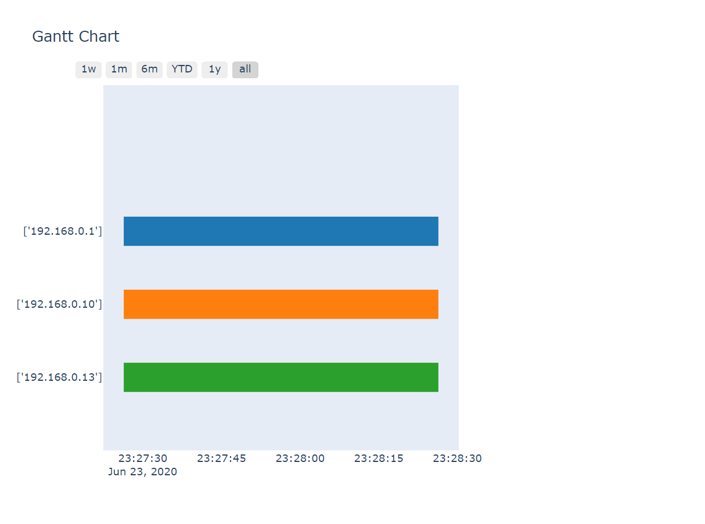
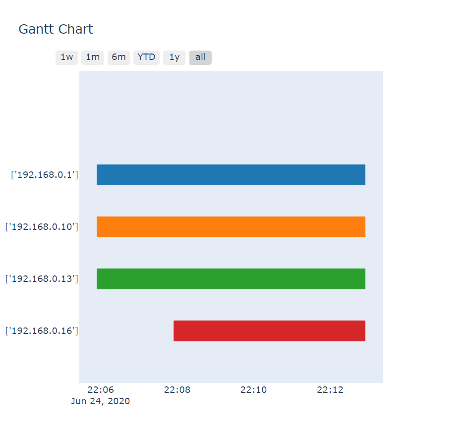
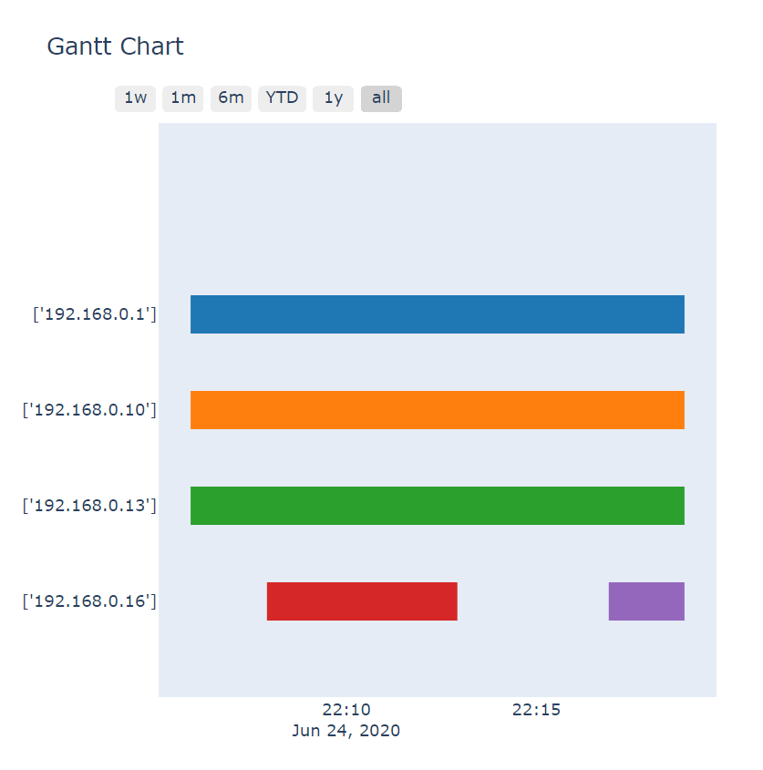
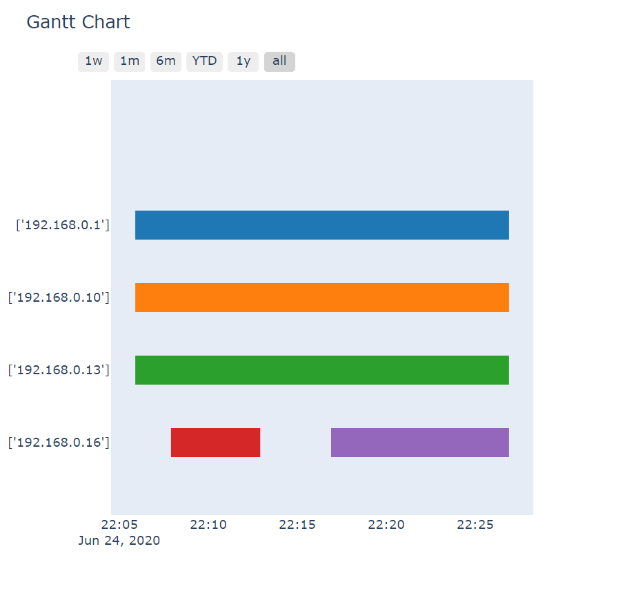

dinko_io

Execute commands in this order:

1. docker-compose up -d
> this will run your docker container in detached mode

2. pip install -r requirements.txt
> install all dependencies

3. python manage.py makemigrations monitor
> makes monitor models migrations

4. python manage.py sqlmigrate monitor 0001
> generates SQL migration

5. python manage.py migrate
> runs your migrations

6. python manage.py runserver --noreload
> runs local instance of django app. --noreload flag prevents django from starting up a second instance of out monitor app (that is default behaviour in debug)

# Screenshots
3 connected clients

4th client connected

4th client disconnected

4th client connected again

